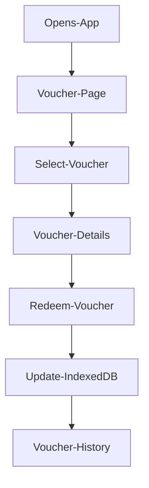

# Voucher PWA

A Progressive Web Application (PWA) for browsing, redeeming, and tracking vouchers. The application provides an offline capable experience using IndexedDB for local data storage and allows users to redeem vouchers while maintaining redemption history.

#
# Team Members
| Member | Role | Responsibilities |
| ------ | ---- | ---------------- |
| Reggie | Project Lead | Project Management, integration, bug fixing, final testing, deployment |
| Ethan | Browser Page Developer | Voucher browsing interface and voucher listings |
| Tshiamo | Voucher Details Developer | Vocuher details page | 
| Tineille | Redeption Flow Developer | Handles voucher redemption | 
| Bohlokoa | History Page Developer | Redemption History and tracking |
| Mia | PWA Setup Developer | Manifest, Service worker and Install Prompt |
| Thandiwe | DataBase Developer | Sores Voucher and redemption history. Handles offline storage |
| Crystal | Mobile Developer | QR Scanning functionality and push notifications | 

#
# Project Overview

The Voucher PWA allows user to: 
* Browse available vouchers
* View voucher details
* Redeem vouchers
* Track redeemed vouchers
* Access data offline
* Install the application as a PWA

The application uses IndexedDB to store voucher data and redemption history locally in the browser.

#
# Features
### Core Features
* Voucher catalogue
* Voucher details page
* Voucher redemption
* Redemption history
* Offline support
* Responsive design
* Installable PWA

### Technical Features
* React
* TypeScript
* IndexedDB
* Service Workers
* PWA Support
* Component based architecture

#
# Folder Structure
```
voucher-pwa/
│
├── app/ 
│   ├── history/ 
│   ├── redeem/ 
│   ├── settings/ 
│   ├── vouchers/
|   ├── favicon.ico 
│   ├── globals.css 
│   ├── layout.tsx 
│   └── page.tsx 
│ 
├── components/ 
│   ├── Button.tsx 
│   ├── Navbar.tsx 
│   ├── QRScanner.tsx 
│   └── VoucherCard.tsx 
│ 
├── lib/
|   ├── indexedDB/
|   ├── notifications/
|   └── types/    
│ 
├── public/ 
│   ├── images/
|   ├── InstallPrompt.tsx
|   ├── manifest.json
|   └── service-worker.js
│ 
├── .gitignore 
├── eslint.config.mjs 
├── next.config.ts 
├── package.json 
├── postcss.config.mjs 
├── tsconfig.json 
└── README.md
```

# Application Flow



# Development Setup
### Clone Reposiitory
```git
  git clone https://github.com/Altair2759/voucher-pwa.git
```

### Navigate To Project
```
  cd voucher-pwa
```

### Install Dependencies
```
  npm install
```

### Start Development Server
```
  npm run dev
```

### Build Production Version
```
  npm run build
```

### Preview Production Build
```
  npm run preview
```


# Git Workflow

### Create Branch
```
  git checkout -b feature/my-feature
```

### Push Changes
```
  git add .
  git commit -m "Add feature"
  git push origin feature/my-feature
```

### Update Branch
```
  git checkout dev
  git pull origin dev
```


# Project Rules

### Development Rules
1. Do not push directly to main
2. Use feature Branches
3. Write meaningful commit messages
4. Test before pushing
5. Keep code clean and readable
6. Do not modify another memeber's feature without discussion
7. Resolve merge conflicts before creating a pull requests

### Commit Format
* feat: add voucher redemption
* fix: resolve history page bug
* style: improve card layout
* docs: update README


# Testing Checklist
- [ ] Voucher list loads
- [ ] Voucher details open correctly
- [ ] Voucher redemption works
- [ ] IndexedDB updates correctly
- [ ] History page updates correctly
- [ ] Offline functionality works
- [ ] Responsive layout works
- [ ] PWA installation works


# Future Improvements
* User authentication
* Cloud syncrhonization
* QR code redemption
* Push notifications
* Voucher categories
* Search and filtering
* Dark mode


# License

This project was created as part of an academic group project and is intended for educational purposes.

  
